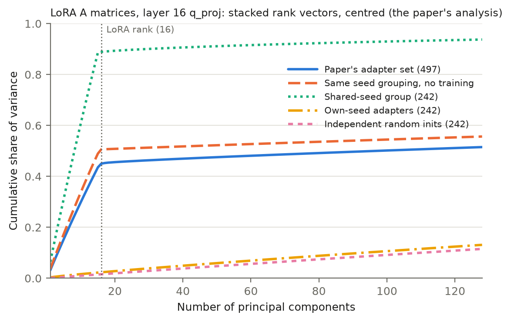

# Shared Initialisation, Not a Universal Subspace: Revisiting the LoRA Evidence for the Universal Weight Subspace Hypothesis

*Draft v2, 2026-10-08. [Author]. Revised after two external reviews (see the revision log at the
end). Items marked **[TODO]** must be resolved before posting.*

## Abstract

Kaushik et al. (arXiv 2512.05117, v3) report that about 500 LoRA adapters for Mistral-7B, each
trained on a different task, share a low-dimensional "universal" subspace, with "most information
concentrated in 16 or fewer directions across all layers". LoRA initialises its down-projection A
at random and its up-projection B at zero, and A moves little in training. We therefore asked how
much of this structure comes from shared initialisation. On the paper's own adapter set (its
Table 10), 255 of 497 adapters (51%) form one group whose A matrices are nearly identical across
different tasks (median pairwise cosine 0.90), consistent with a reused random initialisation.
Across the whole public collection the fraction is 38%, so the paper's set is enriched for it. In
the paper's analysis, this group puts 86-90% of A's variance in 16 directions; the 242 adapters
outside it put 2-5%, close to independent random matrices at the same sample size (1.6%). A
simulated collection with the same grouping and no training at all shows the same rank-16 knee.
The effect survives a factorisation-invariant analysis of ΔW = BA on the input side. The output
side behaves differently: it shows shared structure that is the same with or without the shared
initialisation, exceeds a null that preserves each adapter's singular values in every layer we
examined, and outside the first layer is not explained by the base model's dominant weight
directions. **[TODO: one sentence on the crossed experiment.]** We conclude that the input-side
(A) evidence for a universal LoRA subspace is largely an initialisation artefact, while a weaker,
genuinely shared output-side structure deserves separate study. We recommend that analyses of
adapter collections report seeds, group by inferred initialisation, use factorisation-invariant
statistics and compare against strength-matched nulls.

## 1. Introduction

The Universal Weight Subspace Hypothesis (Kaushik et al., arXiv 2512.05117; we review v3, dated
2026-10-05) proposes that neural networks converge to shared spectral subspaces "regardless of
initialization, task, or domain". One line of evidence is a collection of LoRA adapters (Hu et al.,
2021) for Mistral-7B-Instruct-v0.2, each trained on a Natural Instructions task (Wang et al., 2022)
and released by Brüel-Gabrielsson et al. (2024). For each layer the paper stacks the adapters'
rank vectors into an (N·r) × d matrix, separately for A and B, centres it, and runs a principal
component analysis (Appendix B.5) **[TODO: confirm the stacking description in v3]**. The paper
acknowledges that "the LoRA factorization is not unique" and that its analysis "characterizes
recurring structure in the learned and stored LoRA parameterization ... rather than a
gauge-invariant property of the equivalent full update". It reports no seed information and no
random-matrix baseline for this analysis.

Two facts make initialisation a candidate explanation. First, PEFT initialises A with a
Kaiming-uniform draw from the global random generator, so adapters trained with the same seed and
configuration start from an identical A. Second, A moves little in training. In our own controlled
runs on Qwen2.5-0.5B and Llama-3.2-1B (40 runs; [`dev_scale_report.md`](dev_scale_report.md)),
‖A − A₀‖_F / ‖A₀‖_F was 0.04-0.22, and under a shared seed the input subspaces of unrelated tasks
overlapped by 97-99%. If many adapters in a collection share an initialisation, the stacked A
matrix contains the same r = 16 random vectors many times, and PCA finds about 16 dominant
directions whatever the tasks.

Contributions:

1. On the paper's exact adapter set, we identify one large group of adapters with a common,
   initialisation-like A (51%), robust to the grouping threshold and identical in all layers
   examined (Section 3.1).
2. A matched comparison, size-matched random nulls and a no-training simulation show that the
   rank-16 A spectrum comes from this group (Section 3.2, Figure 1).
3. A crossed task × initialisation experiment on Qwen2.5-0.5B separates seed from task directly
   (Section 3.3).
4. A factorisation-invariant analysis with strength-matched nulls separates what the shared
   initialisation explains (input side) from genuinely shared structure (output side), and tests
   how much of the latter is the base model's dominant directions (Sections 3.4-3.5).
5. The same grouping affects joint-basis compression of this collection (Section 3.6).

We do not test the paper's results on fully trained models (ViTs, ResNets), which do not involve
LoRA initialisation.

## 2. Setup

**Adapters.** Table 10 of v3 lists 502 adapters `Lots-of-LoRAs/Mistral-7B-Instruct-v0.2-4b-r16-taskNNN`
(all present in the public collection of 904 rank-16 adapters). Five are coloured as
out-of-distribution evaluation models; we treat them as held out and analyse the other 497
**[TODO: confirm with the authors which adapters were used to fit the subspace]**. Each adapter
adapts the q, k and v projections of all 32 layers with rank r = 16 and scaling α/r = 2 (constant,
so it cancels in every normalised statistic below). A is r × d_in (d_in = 4,096); B is
d_out × r, with d_out = 4,096 for q and 1,024 for k and v (grouped-query attention). A **slot** is
one (layer, projection) pair; we analyse 15 slots: layers 0, 8, 16, 24, 31 × q, k, v.

**Paper-style spectrum.** For a set of N adapters, stack the r rows of each A (or the r columns of
each B) into an (N·r) × d matrix, centre feature-wise and compute eigenvalues. **Top-16 share** is
the fraction of variance in the 16 largest components; **k90** is the number of components needed
for 90% of the variance.

**Factorisation-invariant spectra.** Writing ΔW_i = B_i A_i, we use the uncentred operators
C_in = Σᵢ ΔW_iᵀ ΔW_i and C_out = Σᵢ ΔW_i ΔW_iᵀ, whose spectra do not depend on how ΔW_i is split
into factors (computed from each adapter's compact SVD via QR of B and Aᵀ). We report their top-16
share. These are one-sided measures of update energy, not PCA over vectorised updates.

**Nulls.** (i) *Size-matched independent initialisations*: N fresh Kaiming-uniform A matrices,
10 repeats. (ii) *Strength-matched*: every adapter keeps its singular values and gets random
orthonormal singular vectors, 10 repeats; this tests orientation given strength. (iii) *Unit-norm*
versions of the real data and null (every ΔW_i scaled to ‖ΔW_i‖_F = 1), which remove differences
in adapter norm and keep only within-adapter anisotropy.

**Inferred groups.** Adapters are linked when the cosine similarity of their layer-0 q_proj A
matrices exceeds 0.5; groups are connected components. We call the large component the *inferred
shared-initialisation group* and the rest *singletons*. These are inferences from A, not recovered
training histories.

## 3. Results

### 3.1 One large group shares an initialisation-like A

On the paper's 497 adapters the grouping yields one group of 255 (51%) and 242 singletons; no
other multi-member groups. Within the group, pairwise cosine of layer-0 q_proj A has minimum 0.55,
10th percentile 0.78 and median 0.90. Between groups, 98% of cosines lie within ±0.010 and the
largest is 0.044. The partition is identical for every threshold from 0.15 to 0.6, and the same
partition is obtained independently from each of the 15 slots.

The group's mean A behaves like an initialisation plus a small averaged change. Its kurtosis is
1.80-1.84 across slots (1.80 for a uniform distribution, 3.0 for a Gaussian); its element standard
deviation is 0.00901-0.00908 (0.00902 for PEFT's U(−1/64, 1/64)); its largest entries reach
0.016-0.020, slightly beyond the uniform bound of 0.0156, as expected if the mean includes some
learned change. Individual adapters lie a median 0.22-0.32 (10th-90th percentile 0.06-0.65) of
the mean's norm away from it. This is distance from the trained group mean, which also absorbs any
change common to the group, so it is a lower bound on movement from the true initialisation.

**Collection-wide.** Over all 904 rank-16 adapters, 342 (38%) belong to the group. The fraction
varies with task number (25-51% across ranges). The paper's set (51%) is enriched relative to a
random 500 (39%), the lowest-numbered 500 (44%) and the whole collection (38%), and the top-16
share of layer-0 q_proj A tracks the group fraction across these sets (0.45, 0.34, 0.38, 0.32).

The model cards and `adapter_config.json` files contain no seed and no evaluation results. Seed 42
and 14 other common seeds did not match the group mean within the first 67 million draws of
PyTorch's CPU generator, and seeds 0-199 did not match at the first six draw positions; the
generator may have been advanced by other code, or the adapters created on a GPU. Nothing below
depends on the seed.

### 3.2 The rank-16 A spectrum comes from the group

| Paper-style A spectrum (15 slots) | Top-16 share | k90 |
|---|---|---|
| Paper's set (497 adapters) | 0.44-0.46 | 1,610-1,738 |
| Same grouping, pure initialisations, no training | 0.51 | — |
| Same grouping, initialisations + random movement of the measured size | 0.46-0.48 | — |
| Shared-initialisation group (242 of 255) | 0.86-0.90 | 16-90 |
| Singletons (242) | 0.021-0.052 | 1,980-2,003 |
| Independent random initialisations (242, 10 repeats) | 0.016 (sd < 0.001) | — |

(Rank caps: 4,096 for the full set; 3,871 for 242 adapters after centring.)

The paper's set shows a sharp knee at exactly the LoRA rank (Figure 1). A collection with the same
grouping and no training at all reproduces the knee, and adding random movement of the measured
size brings the top-16 share to within 0.02-0.04 of the real value. Under row stacking, the top-16
share of such a collection is roughly the shared fraction times the share of each group member's
variance carried by the common A, which is why it tracks the group fraction (Section 3.1).
Singletons are 1.3-3.3 times the size-matched random level, highest in layer 0 (0.036-0.052), so
they are close to, but not exactly, random. The rank-16 concentration is absent among them.

For B, the group and the singletons agree to within 0.015 in every slot (top-16 share 0.11-0.56),
so B's spectrum does not depend on group membership.

*Figure 1. Cumulative variance of the paper-style A spectrum, layer 16 q_proj. The paper's set and
a no-training simulation with the same grouping both jump at the LoRA rank; adapters outside the
group are close to independent random matrices.*

### 3.3 Crossed task × initialisation experiment

**[TODO: results pending.]** Design: the same 10 tasks on Qwen2.5-0.5B, trained with identical
data, optimiser and early stopping under (a) one shared random A per seed for all tasks (two seeds,
i.e. two shared initialisations) and (b) an independent A per task and seed. A subspace is fitted on
nine tasks and evaluated on the held-out task by captured update energy and by task score after
projection, with the basis taken from the same initialisation, the other initialisation, or
independent initialisations. A hardware check reruns four independent-initialisation runs on a
different GPU.

### 3.4 Factorisation-invariant updates: input side and output side differ

| Top-16 share (uncentred, 15 slots) | Group | Singletons | Strength-matched null | Singletons, unit-norm | Null, unit-norm |
|---|---|---|---|---|---|
| Input side, layer 0 | 0.60-0.67 | 0.22-0.37 | 0.12-0.32 | 0.10-0.14 | 0.05-0.07 |
| Input side, layers 8-31 | 0.53-0.60 | 0.11-0.24 | 0.10-0.22 | 0.05-0.11 | 0.05-0.07 |
| Output side, layer 0 | 0.21-0.60 | 0.19-0.62 | 0.14-0.32 | 0.14-0.59 | 0.07-0.09 |
| Output side, layers 8-31 | 0.17-0.33 | 0.15-0.30 | 0.10-0.23 | 0.12-0.26 | 0.05-0.09 |

*Stability.* Over 20 subsamples of 193 of the 242 singletons (without replacement, fresh null
each time), the singleton excess over the strength-matched null is stable. Input side, layers
8-31: 0.002-0.020 (sd ≤ 0.001); output side, layers 8-31: 0.019-0.097 raw (sd ≤ 0.005) and
0.049-0.183 unit-norm (sd ≤ 0.006); layer 0 output q and k: 0.21 and 0.34 raw (sd 0.011).

*Input side.* The group remains far more concentrated than the singletons in the invariant
analysis (0.53-0.67 against 0.11-0.37), so the A-side result is not an artefact of analysing the
stored factors. Outside layer 0, singletons exceed the strength-matched null by only 0.003-0.022
(unit-norm: up to 0.04). Layer 0 shows more (0.034-0.103).

*Output side.* Group and singletons are similar (0.17-0.60 against 0.15-0.62), so the output side
is not an initialisation effect. Singletons exceed the strength-matched null in every slot: by
0.019-0.106 outside layer 0 and by 0.22 (q) and 0.36 (k) in layer 0 (v: 0.047). With unit-norm
updates the gap widens (0.12-0.26 against 0.05-0.09 outside layer 0), so it is not produced by a few
large adapters.

*What the null contains.* Each ΔW is effectively low-rank (median participation ratio 2.1-5.6
across slots; the top singular value carries a median 34-67% of each update's energy), and adapter
norms vary widely (largest/median 2.7-7.8; 90th/10th percentile 5.9-9.3). These alone give
top-16 shares of 0.10-0.32, so equal-weight random baselines overstate how surprising the observed
concentration is.

### 3.5 How much of the remaining structure is the base model?

We compare the singletons' shared subspaces with the base weight's singular subspaces, and recompute
the excess over the null after projecting out the base weight's top-k directions from both the
data and the null.

| | Overlap with base top-16 (× chance) | Excess over null | Excess after removing base top-128 |
|---|---|---|---|
| Input, layer 0 q / k / v | 44× / 32× / 22× | 0.053 / 0.034 / 0.103 | 0.001 / 0.002 / 0.094 |
| Input, layers 8-31 | 0.7-6.2× | 0.003-0.022 | 0.000-0.021 |
| Output, layer 0 q / k / v | 17.6× / 12.4× / 1.8× | 0.220 / 0.362 / 0.047 | 0.176 / 0.146 / 0.048 |
| Output, layers 8-31 | 0.8-3.0× | 0.019-0.106 | 0.018-0.119 |

(Overlap is the mean cos² of principal angles between the two 16-dimensional subspaces; chance is
16/d.) The small input-side excess in layer 0 q and k is accounted for by the base weight's
dominant input directions. On the output side, the base weight accounts for about 60% of the layer-0
k excess and about 20% of the layer-0 q excess, and for none of the excess in layers 8-31. The
output-side shared structure outside layer 0 is therefore real, independent of initialisation and
not explained by base-weight directions. We do not know what it is; candidates include directions
favoured by the training data format common to all Natural Instructions tasks, and activation
statistics that weight singular vectors do not capture.

**Learned movement of A.** Within the group, A minus the group mean is modestly more concentrated
than a strength-matched null (top-16 share 0.09-0.30 against 0.07-0.17; largest in layer 0), so
training moves A in partly shared directions, but this is small next to the initialisation.

### 3.6 The grouping also affects compression

Brüel-Gabrielsson et al. (2024), who trained this collection, serve many LoRAs by approximating
each update as U Σᵢ Vᵀ with shared bases U, V; they report that clustering adapters helps for
n ≥ 100 and use a reconstruction-loss threshold of 0.6 **[TODO: verify quotes and their error
definition]**. We re-implemented JD-Full (updates normalised to unit Frobenius norm, 10 alternating
iterations, no clustering) on 100-adapter sets, for 6 slots (layers 0, 16, 31 × q, v). We report
the mean relative squared Frobenius error 1 − ‖UᵀΔW_iV‖²_F per adapter; with unit-norm updates this
equals the squared error ratio of their Theorem 1.

| Rank | Group set | Singleton set | Mixed 50/50: group half | Mixed: singleton half |
|---|---|---|---|---|
| 16 | 0.64-0.86 | 0.85-0.90 | 0.67-0.83 | 0.87-0.98 |
| 32 | 0.44-0.75 | 0.72-0.81 | 0.51-0.77 | 0.70-0.80 |
| 64 | 0.25-0.59 | 0.50-0.65 | 0.34-0.64 | 0.41-0.60 |

Results are insensitive to the optimiser's initialisation (input-based vs random: ≤ 0.012), agree
across three restarts, match exact SVD to within 0.001 (checked on layer 16 q_proj), and converge
within about three iterations. At ranks 16-32 a shared basis fitted to a mixed set serves mostly
the group's adapters; by rank 64 the difference shrinks and reverses in some slots. Clusters found
in such a collection may partly reflect initialisation rather than task. We did not test serving
quality.

## 4. Discussion

**What the evidence supports.** On the paper's own adapters, the A-side "universal subspace" is
produced by one large group of adapters with a common initialisation-like A, which training
changes only modestly. The effect persists in a factorisation-invariant analysis of the input
side. Without the group, the input side is close to a strength-matched null except in layer 0,
where the excess follows the base weight. The output side tells a different story: a shared
structure present with and without the common initialisation, above a strength-matched null in
every slot and, outside layer 0, not explained by base-weight directions. It is spread over far
more than 16 directions (k90 of B 140-1,200 on the full set).

**The strongest rebuttals.**
- *"Our exact analysis differs."* We used the paper's adapter list and its stacking convention;
  the full-set top-16 share is 0.44-0.46, and the knee at r = 16 is reproduced by a no-training
  simulation. "Most information in 16 or fewer directions" is therefore best read as describing
  this knee.
- *"One 16-dimensional input subspace serving 255 tasks is itself universality."* The subspace is
  a random one, and the other 242 adapters each use a different random one; any random
  16-dimensional input subspace appears to suffice. This is redundancy, consistent with frozen-A
  LoRA variants (Zhang et al., 2023, LoRA-FA) **[TODO: cite]**, not evidence of a privileged
  subspace. Whether task performance differs between the group and the singletons cannot be
  checked from published numbers (the model cards report none) **[TODO: or evaluate a sample]**.
- *"The output side is shared."* We agree, and treat it as the part of the claim that survives. It
  should be analysed separately from A and against strength-matched nulls.
- *"Low effective rank and uneven norms are themselves low-dimensional structure."* They are
  properties of individual adapters, not shared directions; Section 3.4 reports both baselines so
  readers can see what each removes.

**Recommendations for analyses of adapter collections.**
1. Report how initialisations were seeded, and check directly for shared initialisations
   (pairwise cosine of A suffices).
2. Analyse inferred initialisation groups separately, or remove the initialisation before pooling.
3. Use factorisation-invariant statistics of ΔW (uncentred C_in, C_out), and analyse input and
   output sides separately.
4. Compare against size-matched and strength-matched nulls, not equal-weight random matrices.
5. Apply the same checks to methods that exploit shared structure (joint-basis compression,
   clustering, continual-learning methods based on LoRA subspace angles).

**Limitations.** One collection and base model; 15 of 96 slots; the fitting/evaluation split of
Table 10 inferred from its colouring; the shared seed not recovered; base-model alignment measured
with weight singular vectors rather than activation statistics; compression re-implemented without
clustering or serving evaluation. Our claims concern the LoRA evidence only.

**A constructive direction.** Adapter geometry is only interpretable when the update shape is set
by the task rather than the seed. Task-gradient initialisation (LoRA-GA, Wang et al., 2024;
LoRA-One, Zhang et al., 2025) and preconditioned updates (Zhang & Pilanci, 2024) are candidates for
seed-invariant adapters; whether they deliver it is an open, testable question.

## 5. Related work

**[TODO: short paragraph.]** LoRA initialisation (PiSSA, LoRA-GA, LoRA-One); asymmetry between A
and B (Zhu et al., 2024) and frozen-A variants (LoRA-FA); recycling adapters into shared bases
(EigenLoRAx, 2025; Compress then Serve, 2024); shared LoRA subspaces in continual learning (O-LoRA;
arXiv 2602.06043).

## 6. Reproducibility

Code: `scripts/universal_subspace/` (`common.py` helpers; `analyse.py` grouping, spectra, nulls,
factorisation-invariant and base analyses, compression; `supplement.py` residual movement,
strength profiles and Figure 1 curves; `excess_subsample.py`; `grouping_all.py`; `figure1.py`;
seed search scripts). Crossed experiment: `configs/experiments/dev_3080_crossed_*.yaml`,
`scripts/crossed_test.sh`, `scripts/crossed_eval.py`. Outputs: `results/universal_subspace/`
(`paper_set.json`, `supplement.json`, `grouping_all.json`, `excess_subsample.json`) and
`results/crossed_eval/`. The adapter list is
`results/universal_subspace/manifest_paper_v3.json`; all random generators are seeded and the
seeds recorded in the outputs. **[TODO: public repository link; make data paths configurable.]**

## References

**[TODO: complete and verify all entries.]**

- Brüel-Gabrielsson, R., Zhu, J., Bhardwaj, O., Choshen, L., Greenewald, K., Yurochkin, M., Solomon, J. (2024). Compress then Serve: Serving Thousands of LoRA Adapters with Little Overhead. arXiv 2407.00066.
- Hu, E. J., et al. (2021). LoRA: Low-Rank Adaptation of Large Language Models. arXiv 2106.09685.
- Kaushik, et al. (2025). The Universal Weight Subspace Hypothesis. arXiv 2512.05117 (v3, 2026).
- Wang, S., et al. (2024). LoRA-GA: Low-Rank Adaptation with Gradient Approximation. arXiv 2407.05000.
- Wang, Y., et al. (2022). Super-NaturalInstructions. EMNLP 2022.
- Zhang, F., Pilanci, M. (2024). Riemannian Preconditioned LoRA for Fine-Tuning Foundation Models. arXiv 2402.02347.
- Zhang, Y., et al. (2025). LoRA-One. arXiv 2502.01235.

## Revision log (v1 → v2)

Responses to the ChatGPT review (`review_gpt_note_lora_universal_subspace.md`) and the Claude review
(`review_note_lora_universal_subspace.md`):

| Point | Change |
|---|---|
| Paper's adapter list exists (v3 Table 10); headline not reproduced on our sample | All analyses rerun on the paper's set (497 after excluding 5 OOD); top-16 share 0.44-0.46; the knee is reproduced by a no-training simulation; the paper's set is shown to be enriched for the group (51% vs 38% collection-wide) |
| Stacking convention | Row stacking, as in the paper's Appendix B.5 **[TODO: confirm in v3]** |
| v3 acknowledges factorisation dependence | Quoted in the introduction |
| Centring breaks factorisation invariance | Invariant analyses now use uncentred C_in, C_out |
| Base-alignment numbers wrong (10-50×); causal claim too strong | Corrected (Section 3.5); excess after removing base directions now measured; conclusion limited to layer-0 q/k |
| Null at wrong N; "indistinguishable" | Size-matched null (N = 242, 10 repeats); wording "close to random, 1.3-3.3×" |
| Clusters are inferred, not seed histories; "untouched init"; distance from group mean | Terminology changed; kurtosis leads; distance described as from the group mean, a lower bound |
| "Almost all", "reproduces the spectrum"; 5% noise in the simulation | Simulation now pure, plus a movement-matched variant; output-side structure reported as real |
| Repeated nulls, bootstraps, unit-norm | 10 null repeats; unit-norm variants; subsample spread (20 × 80%, without replacement) |
| JD: seeding, restarts, exact SVD, init sensitivity, metric name | All added (Section 3.6); metric named precisely |
| Threshold sensitivity, all-slot agreement, saved diagnostics | Thresholds 0.15-0.6 and all 15 slots; all diagnostics saved to JSON |
| Provenance: manifest, no `exec` of external files | `common.py`, manifest input, seeds recorded |
| Seed in metadata? | Checked: none in model cards or configs |
| Learned movement of A in the group | Strength-matched null on the residual (Section 3.5) |
| What the null is made of | Effective ranks and norm spread reported (Section 3.4) |
| Crossed task × initialisation experiment | Run on Qwen2.5-0.5B (Section 3.3) **[pending]** |
| 903 vs 904; rank cap; d_out for k/v; define slot, top-16 share, k90; "gauge-free" | Fixed / defined in Section 2 |
| Performance by group | Not possible from published cards; listed as a limitation |
